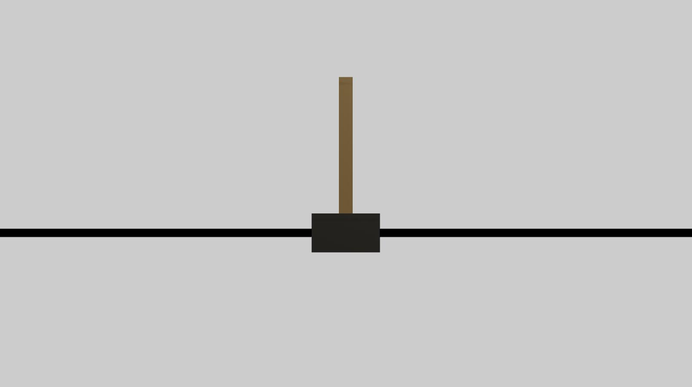

# Unity ML Agents: Cartpole

A preview of the power of Unity's new ML Agents package.

## Description
This Unity project, utilises Unity's latest ML Agents package, to effectively train a inverted pendulum (see the [inverted pendulum problem](https://en.wikipedia.org/wiki/Inverted_pendulum) for more info) that was orginally tuned using pid controller. View this documet for hardware and electrical documents details [link](https://drive.google.com/file/d/1X3vsImvLk0jdw_lM1OiAD35FWt6vES8k/view?usp=drivesdk)
## Why?
The original idea was to replace the manual pid training process with a neural network or reinforcement learning model which will tune itself and can possibly show better results than the pid one.This is the original harware performace after removing the resetting mechanism , showcasing the models performance.


https://github.com/user-attachments/assets/9f81d5bd-68bd-4954-ba4e-27f6ab6f294f


# Setup
## Prerequisites
In order to run this project on your computer, you will need Unity 2019.3.x or greater. I haven't included a built version of the game in this repo as I feel that the most important thing in regards to this project is it's inner workings.

However, if you are wanting to train the model yourself, or test out the process, you will need:
```
Python 3.7/3.8
mlagents
```

## Installing
Run the following commands in your command prompt to install the prerequsities listed above:
```
pip install mlagents
```
This should also install the required tensorflow package, but if, for some reason, it fails to do so, run the following command:
```
pip install tensorflow
```

# License
[](https://opensource.org/licenses/MIT)
